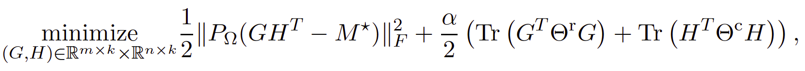

## Graph Regularized Matrix Completion
This repository contains the implementation of algorithms for Graph-Regularized Matrix Completion proposed in the paper: 

S. Dong, P.-A. Absil, and K. A. Gallivan. Riemannian gradient descent methods for graph-regularized matrix completion. *Linear Algebra and its Applications*, 2020. https://doi.org/10.1016/j.laa.2020.06.010.


Shuyu Dong. ICTEAM, UCLouvain, Louvain-la-Neuve, Belgium. 

Email: `shuyu.dong@m4x.org` 


### The graph-regularized matrix completion problem
The proposed algorithms are designed to solve the following matrix completion problem, 
<p align="center">

</p>

where 
 is the set of indices of the known entries of
, and 
 
and 
 
are two graph Laplacian matrices given that encode row-wise and column-wise similarities of , respectively.


### Installation and examples 

Download or clone this repository and then access the folder in MATLAB. Install the package by running: 

```matlab
startup; install; 
```

The following script contains an example on synthetic data:  
```matlab
test_example.m  
```

To test with a given real-world dataset, it suffices to make sure that the input matrix is a (sparse) matrix in the MATLAB format. 

### Requirements
- `Manopt`: In this package, some manifold objects and utilities of Manopt (https://www.manopt.org/index.html) are used in the construction of the main problem class (`core/GRMC.m`). These Manopt functions are already included in `tools/manopt/`. 
- `Roptbox`: The problem class `GRMC` and the solvers in this package are a part of the `Roptbox` package, and are included in `core/`.  

